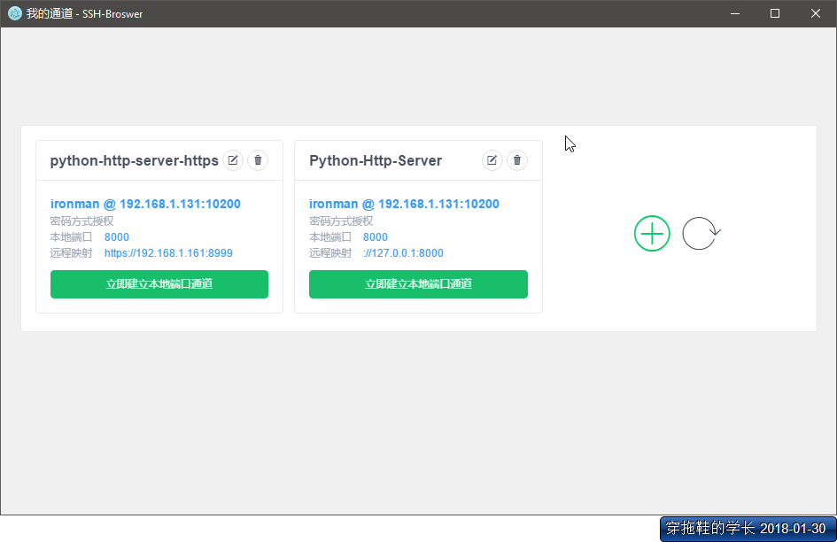
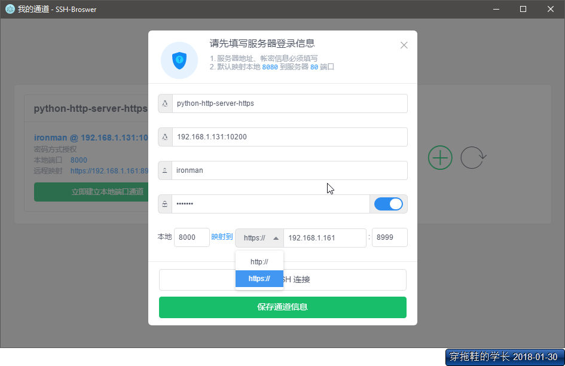
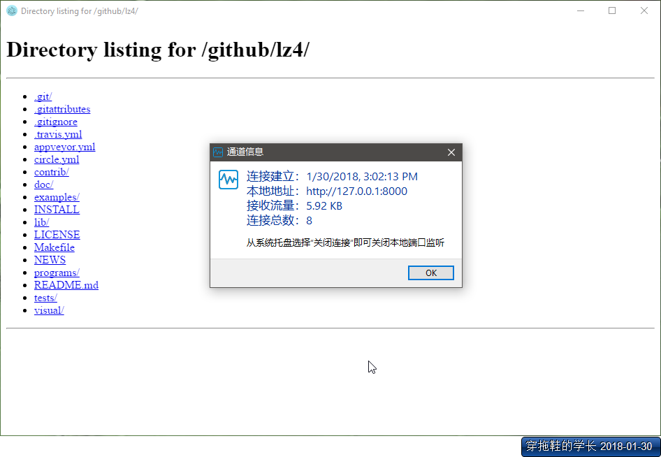

# ssh-broswer
> 基于 `Electron` 搭建的`ssh`隧道浏览器，主要用于需要通过隧道进行 web 访问的场景 🌝

**运行截图**








## SSH 授权简述
> `ssh` 常用的方式有`帐密`、`privateKey`

### 帐密方式

在 `ssh服务器` 创建用户供登录：

```shell
useradd test

passwd test
# 然后输入两次密码

# 删除用户
userdel test
```

用户创建后就能使用`test`登录

### privateKey
> TODO

## 构建&运行
> 图标在线转换：<https://www.easyicon.net/covert/>

### 感谢

[ssh2](https://github.com/mscdex/ssh2)

### 问题汇总

**Cannot assign to read only property 'exports' of object**

详见：<http://blog.csdn.net/u013034736/article/details/70174425>

### Build Setup

``` bash
# install dependencies
npm install

# serve with hot reload at localhost:9080
npm run dev

# build electron application for production
npm run build


```

---

This project was generated with [electron-vue](https://github.com/SimulatedGREG/electron-vue)@[195b599](https://github.com/SimulatedGREG/electron-vue/tree/195b59990e317184cbc3603f5ed7aed6ce05f7c9) using [vue-cli](https://github.com/vuejs/vue-cli). Documentation about the original structure can be found [here](https://simulatedgreg.gitbooks.io/electron-vue/content/index.html).


## LOGS

### v1.0.2

* iview 升级到 `2.13.0`
* 增加隧道连接失败的友情提示
* 修改部分`UI`

### v1.0.3

* 打包统一修改为 `ia32`（程序体积得到10%的缩减）
* 增加 `preload.js`（目前没有实际运用）
* 程序主页增加版本信息
* 修复：断开通道后主页按钮不更新的bug

### v1.0.4

* 增加私钥文件登录